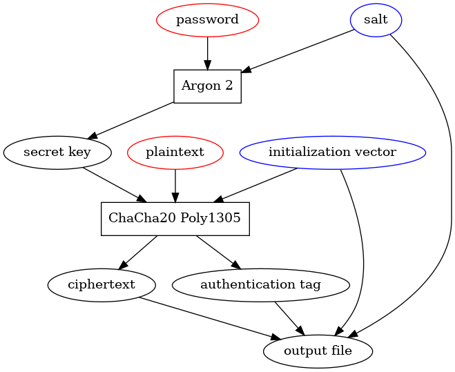

# grys
Symmetric key encryption program

Features:
- Use a short password to encrypt and decrypt your files.
- No need to set up public and private keys.
- Authenticated encryption makes sure that the file hasn't been tampered with.
- Can process streams of text from standard input and output.

# Install
Requires these libraries installed in their default locations (may require root privileges)
- [Libgcrypt](https://www.gnupg.org/download/index.html)
- [Libgpg-error](https://www.gnupg.org/download/index.html)
- [Argon2](https://github.com/P-H-C/phc-winner-argon2)

Then download this repository and 
run `make` to compile the `grys` program.

# Use
```
./grys [-d|-e] {password_flags} {-k} input_file output_file 

Choose whether to encrypt or decrypt the input file:
-e    encrypt input_file
-d    decrypt input_file

Provide a password using any of these flags:
-p password         provide password on command line
-f password_file    read password from password_file
-n                  read password from the GRYS_PASSWORD environment variable

If grys is called with no password flag, then the user will be prompted to enter the password.

(Optional)
-k                  delete input_file once it has been processed

(Required)
input_file          the file to encrypt or decrypt
output_file         where to save the encrypted or decrypted output

If input_file or output_file is "", then the input will be read from stdin or the output will be written to stdout, respectively.
```
The program then does the following steps:



Figure 1. The algorithm for encrypting plaintext to ciphertext as implemented in `grys`. Ellipses represent data, rectangular boxes represent algorithms. The data in red ellipses are supplied by the user. The data in blue ellipses are randomly generated by the software.

# Limitations
- passwords limited to 50 characters
- maximum file name length 300 characters

# Author and License
Copyright :copyright: 2022 Alan Tseng

GNU General Public License v3